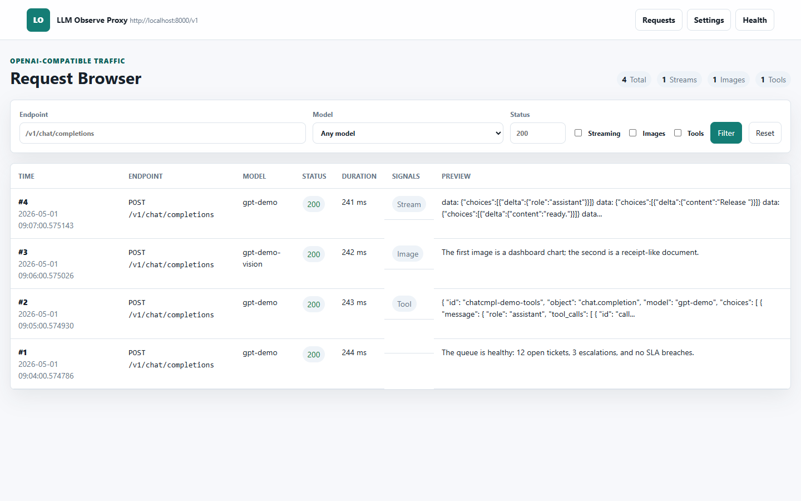
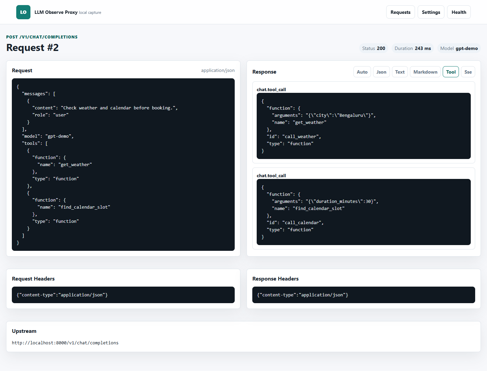
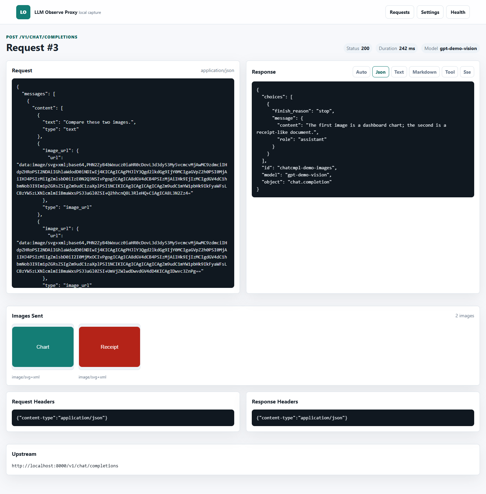
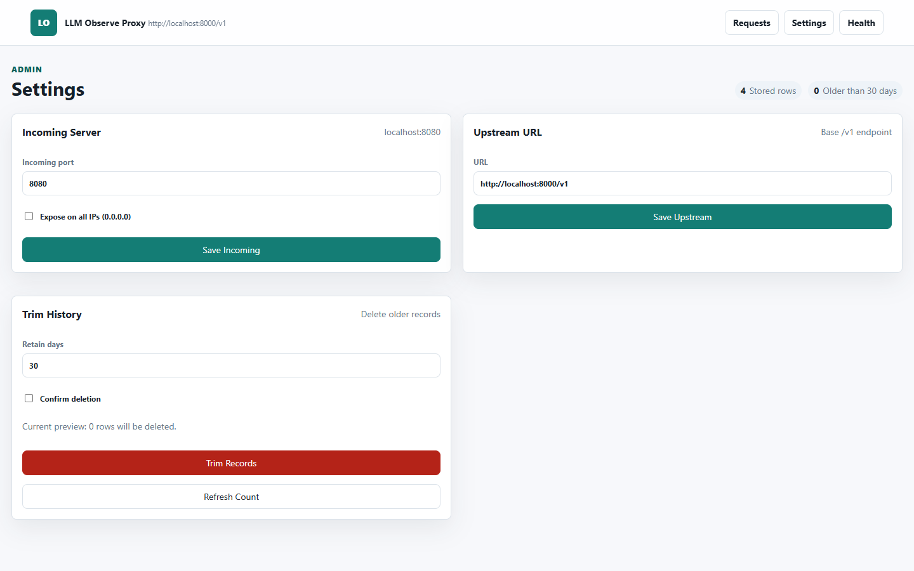

# LLM Observe Proxy

`llm-observe-proxy` is an OpenAI-compatible, record-only proxy for inspecting LLM
traffic. It forwards requests to an upstream `/v1` API, stores requests and responses in
SQLite, and provides a polished local admin UI for browsing, pretty-printing, trimming,
and changing runtime settings.

It is useful when you want LiteLLM-style observability without introducing a full gateway
or external database.

## Features

- OpenAI-compatible passthrough route: `ANY /v1/{path:path}`.
- SQLite capture for request/response headers, bodies, status, timing, model, endpoint,
  streaming state, tool-call signals, image assets, and errors.
- Admin UI for searching and browsing captured traffic.
- Detail pages with response render modes for JSON, plain text, Markdown, tool calls,
  and raw SSE streams.
- Request image gallery for data URL and remote image references.
- Settings UI for upstream URL, incoming host/port preferences, all-IPs exposure, and
  retention trimming.
- No authentication by default, intended for local or trusted development networks.

## Install

After the package is published:

```powershell
python -m pip install llm-observe-proxy
llm-observe-proxy
```

For local development from this repository:

```powershell
C:\Python\Python313\python.exe -m venv .venv
.\.venv\Scripts\python.exe -m pip install -e .[dev]
.\.venv\Scripts\llm-observe-proxy.exe
```

By default, the proxy listens on:

```text
http://localhost:8080
```

and forwards requests to:

```text
http://localhost:8000/v1
```

Open the admin UI:

```text
http://localhost:8080/admin
```

## Usage

Point an OpenAI-compatible client at the proxy:

```python
from openai import OpenAI

client = OpenAI(
    api_key="local-dev-key",
    base_url="http://localhost:8080/v1",
)

response = client.chat.completions.create(
    model="gpt-demo",
    messages=[{"role": "user", "content": "Hello through the proxy"}],
)
print(response.choices[0].message.content)
```

Run on a different port:

```powershell
llm-observe-proxy --port 8090
```

Expose on all interfaces:

```powershell
llm-observe-proxy --expose-all-ips
```

Set the upstream from the CLI:

```powershell
llm-observe-proxy --upstream-url http://localhost:8000/v1
```

You can also change the upstream URL and next-start incoming host/port settings from
`/admin/settings`.

## Screenshots

Screenshots are generated from a seeded demo database and stored in `docs/screenshots`.

| Request browser | Tool calls |
| --- | --- |
|  |  |

| Images | Settings |
| --- | --- |
|  |  |

Additional screenshots:

- [Simple request detail](docs/screenshots/simple-request.png)
- [Streaming SSE detail](docs/screenshots/streaming.png)

Regenerate screenshots:

```powershell
.\.venv\Scripts\python.exe scripts\seed_demo_db.py .tmp\screenshots.sqlite3
.\.venv\Scripts\python.exe scripts\capture_screenshots.py --database .tmp\screenshots.sqlite3 --output docs\screenshots
```

## Routes

- `ANY /v1/{path:path}`: OpenAI-compatible pass-through proxy.
- `GET /admin`: request browser.
- `GET /admin/requests/{id}`: request/response detail view.
- `GET /admin/settings`: upstream settings and retention tools.
- `POST /admin/settings/incoming`: update incoming host/port settings for next startup.
- `POST /admin/settings/upstream`: update upstream URL.
- `POST /admin/trim`: delete records older than `N` days.
- `GET /healthz`: health check.

## Configuration

Environment variables:

| Variable | Default | Purpose |
| --- | --- | --- |
| `LLM_OBSERVE_DATABASE_URL` | `sqlite:///./llm_observe_proxy.sqlite3` | SQLite SQLAlchemy URL. |
| `LLM_OBSERVE_INCOMING_HOST` | `localhost` | Bind host when not exposing all IPs. |
| `LLM_OBSERVE_INCOMING_PORT` | `8080` | Bind port. |
| `LLM_OBSERVE_EXPOSE_ALL_IPS` | `false` | Bind to `0.0.0.0` when true. |
| `LLM_OBSERVE_UPSTREAM_URL` | `http://localhost:8000/v1` | Upstream OpenAI-compatible `/v1` base URL. |
| `LLM_OBSERVE_LOG_LEVEL` | `INFO` | Uvicorn log level. |

Incoming host/port settings saved in the UI are used on the next process startup; they do
not rebind a currently running process.

## Tests

```powershell
.\.venv\Scripts\ruff.exe check src tests
.\.venv\Scripts\python.exe -m compileall -q src tests
.\.venv\Scripts\pytest.exe -q
```

The test suite starts a fake upstream on `localhost:8080/v1`, so stop any local process
using port `8080` before running tests. See [docs/tests/README.md](docs/tests/README.md)
for the full coverage matrix.

## Publishing

See [docs/publishing.md](docs/publishing.md) for name checks, build commands, and the
pre-publish checklist.

## License

MIT. See [LICENSE](LICENSE).
