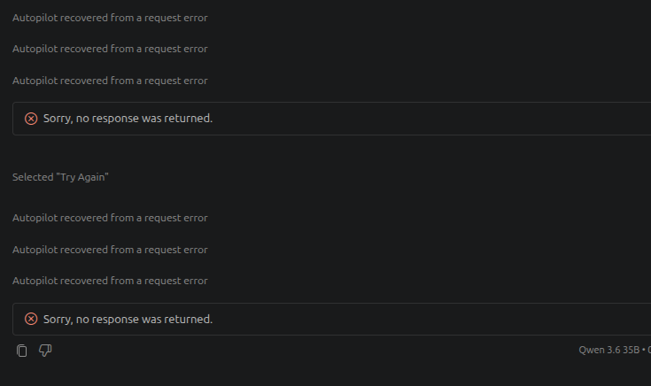

# llama.cpp Issue Notes: Qwen3.6 Copilot Tool Call Leaks Through Reasoning

Date: 2026-05-04

Local capture DB: `llm_observe_proxy.sqlite3`

Run: `2`, `Example App CoPilot`

Affected client: VS Code GitHub Copilot Chat Agent/Autopilot mode

Affected endpoint: `POST /v1/chat/completions`

This document is intended as source material for a llama.cpp issue and for
building a parser regression test. The llama.cpp issue template says the user
should fill out the issue themselves and not paste language-model-generated
issue text directly, so treat this as evidence and a structured checklist rather
than a copy-paste issue body.

Relevant upstream template:

- <https://raw.githubusercontent.com/ggml-org/llama.cpp/master/.github/ISSUE_TEMPLATE/011-bug-results.yml>

## Short Summary

On latest llama.cpp master at system fingerprint `b9022-d8794eecd`, GitHub
Copilot repeatedly received valid HTTP 200 streaming responses that were empty
from an OpenAI-compatible client perspective:

- `delta.content` was absent or empty.
- `delta.tool_calls` was absent.
- `delta.reasoning_content` contained a Qwen tagged tool call.
- The final choice had `finish_reason: "stop"`, not `"tool_calls"`.
- The SSE stream ended normally with `data: [DONE]`.

Copilot displayed:

```text
Autopilot recovered from a request error
Sorry, no response was returned.
```

The model's intended next action was a valid `read_file` tool call for:

```text
/tmp/example-workspace/example-project/backend/requirements.txt
```

but llama.cpp streamed it only inside `reasoning_content`:

```text
The requirements.txt has an incorrect package name. Let me check and fix it:

<tool_call>
<function=read_file>
<parameter=endLine>
30
</parameter>
<parameter=filePath>
/tmp/example-workspace/example-project/backend/requirements.txt
</parameter>
<parameter=startLine>
1
</parameter>
</function>
</tool_call>
```

There is no preceding `</think>` marker in this generated text. This appears to
be the still-uncovered variant after the prior fixes: a tagged tool call emitted
while the parser still classifies output as reasoning.

## llama.cpp Issue Template Fields

The issue should likely use:

```text
Eval bug: Qwen3.6 tool call emitted only in reasoning_content after terminal failure
```

### Name and Version

Need exact `--version` output from the affected server:

```console
$ ./llama-server --version
TODO: paste exact output
```

Known from captured SSE and startup log:

```text
system_fingerprint: b9022-d8794eecd
startup build_info: b9022-d8794eecd
```

GitHub lookup for short SHA `d8794eecd` resolved to:

```text
d8794eecd582b35ab5540e748dba057fc48ebe8b
examples: refactor diffusion generation (#22590)
committer date: 2026-05-04T12:19:30Z
```

This is after both related PR merges:

- `#22657`: `e48034dfc9e5705248fd39dc437ca887dc55a528`
- `#22654`: `a4701c98f72160144b101090596c7ea1ef0c1d7b`

### Operating Systems

Observed client/workspace OS:

```text
Linux
```

Observed server shell prompt:

```text
root@C.36118200:/workspace$
```

The server appears to be running in a Linux container/workspace. TODO: include
the exact host/container distro if available.

### GGML Backends

```text
CUDA
```

Startup log:

```text
ggml_cuda_init: found 1 CUDA devices (Total VRAM: 32109 MiB):
  Device 0: NVIDIA GeForce RTX 5090, compute capability 12.0, VMM: yes, VRAM: 32109 MiB
system_info: n_threads = 192 (n_threads_batch = 192) / 384 | CUDA : ARCHS = 1200 | USE_GRAPHS = 1 | PEER_MAX_BATCH_SIZE = 128 | BLACKWELL_NATIVE_FP4 = 1 | CPU : SSE3 = 1 | SSSE3 = 1 | AVX = 1 | AVX2 = 1 | F16C = 1 | FMA = 1 | BMI2 = 1 | AVX512 = 1 | AVX512_VBMI = 1 | AVX512_VNNI = 1 | AVX512_BF16 = 1 | LLAMAFILE = 1 | OPENMP = 1 | REPACK = 1 |
```

### Hardware

```text
NVIDIA GeForce RTX 5090, 32109 MiB VRAM, compute capability 12.0
CPU: 384 hardware threads visible to llama.cpp, 192 inference threads configured
```

### Models

Request model seen by Copilot:

```text
Qwen 3.6 35B
```

Response model in SSE:

```text
qwen3.5-35b-a3b-q6-vl
```

Prior local analysis also used:

```text
Qwen3.6-35B-A3B-MXFP4_MOE.gguf
```

Affected server startup log shows:

```text
model path: /workspace/models/qwen35-35b-a3b/Qwen3.5-35B-A3B-Q6_K.gguf
general.name: Qwen3.5-35B-A3B
general.basename: Qwen3.5-35B-A3B
general.quantized_by: Unsloth
general.size_label: 35B-A3B
general.license: apache-2.0
general.repo_url: https://huggingface.co/unsloth
base model organization: Qwen
file type: Q6_K
file size: 26.86 GiB
architecture: qwen35moe
context_length metadata: 262144
```

TODO: fill exact model download URL if this came from a specific Hugging Face
repository/revision.

### Server Startup And Runtime Parameters

Start command:

```shell
tmux new-session -d -s llama "bash -lc '
  export LD_LIBRARY_PATH=\"$LD_LIBRARY_PATH\"

  \"$LLAMA_SERVER\" \
    --model \"$MODEL_PATH\" \
    --mmproj \"$MMPROJ_PATH\" \
    --no-mmproj-offload \
    --alias qwen3.5-35b-a3b-q6-vl \
    --host 0.0.0.0 \
    --port \"$LLAMA_PORT\" \
    --ctx-size 150000 \
    -np 1 \
    -ngl 999 \
    --flash-attn on \
    --jinja \
    -ctk q8_0 \
    -ctv q8_0 \
    --image-min-tokens 1024 \
    --metrics \
    2>&1 | tee /workspace/llama-server-source-build.log
'"
```

Expanded known values from startup log:

```text
MODEL_PATH=/workspace/models/qwen35-35b-a3b/Qwen3.5-35B-A3B-Q6_K.gguf
alias=qwen3.5-35b-a3b-q6-vl
host=0.0.0.0
ctx-size=150000
np=1
ngl=999
flash-attn=on
jinja=enabled
ctk=q8_0
ctv=q8_0
mmproj=enabled via MMPROJ_PATH
mmproj offload=disabled
image-min-tokens=1024
metrics=enabled
```

Known from startup log:

```text
Running without SSL
init: using 383 threads for HTTP server
main: loading model
srv load_model: loading model '/workspace/models/qwen35-35b-a3b/Qwen3.5-35B-A3B-Q6_K.gguf'
common_init_result: fitting params to device memory
common_fit_params: successfully fit params to free device memory
llama_prepare_model_devices: using device CUDA0 (NVIDIA GeForce RTX 5090) - 31600 MiB free
load_tensors: offloading output layer to GPU
load_tensors: offloading 39 repeating layers to GPU
load_tensors: offloaded 41/41 layers to GPU
llama_context: n_seq_max     = 1
llama_context: n_ctx         = 150016
llama_context: n_ctx_seq     = 150016
llama_context: n_batch       = 2048
llama_context: n_ubatch      = 512
llama_context: flash_attn    = enabled
llama_context: kv_unified    = false
llama_context: n_ctx_seq (150016) < n_ctx_train (262144)
llama_kv_cache: CUDA0 KV buffer size = 1556.56 MiB
llama_memory_recurrent: CUDA0 RS buffer size = 62.81 MiB
sched_reserve: fused Gated Delta Net (autoregressive) enabled
sched_reserve: fused Gated Delta Net (chunked) enabled
```

The log shows that `common_params_fit_impl` ran; the llama.cpp issue template
asks that bugs during fit be reproduced with `-fit off`, or that `--verbose`
logs be provided if the bug only occurs with `-fit on`.

### Problem Description And Steps To Reproduce

Observed in VS Code GitHub Copilot Chat Agent/Autopilot mode using
llama-server's OpenAI-compatible `/v1/chat/completions` endpoint.

High-level reproduction flow:

1. Use a Qwen thinking model with OpenAI-compatible tools enabled.
2. Drive a multi-turn agent workflow through Copilot.
3. Reach a turn where a terminal command fails.
4. In this capture, the preceding tool was:

   ```text
   run_in_terminal:
   cd /tmp/example-workspace/example-project/backend &&
   source venv/bin/activate &&
   pip install -r requirements.txt
   ```

5. The terminal tool result ended with:

   ```text
   ERROR: Could not find a version that satisfies the requirement python-cors>=0.0.1
   ERROR: No matching distribution found for python-cors>=0.0.1
   ```

6. The model decided to inspect `backend/requirements.txt` via `read_file`.
7. llama.cpp streamed the intended Qwen tagged tool call only inside
   `delta.reasoning_content`.
8. No structured OpenAI `delta.tool_calls` appeared.
9. The final finish reason was `"stop"`.
10. Copilot treated the turn as empty and showed "Sorry, no response was
    returned."

This repeated deterministically across rows `1142` through `1149` when Copilot
retried.

### First Bad Commit

Unknown.

This was observed on a post-fix commit after:

- `#22654` common/autoparser newline handling / forced tool-call fixes
- `#22657` generation prompt longest-common-prefix fix

No bisect has been performed.

### Relevant Log Output

The sections below contain sanitized request and response evidence.

## Observed Rows

Rows `1138` through `1141` show normal structured tool calls immediately before
the failure. Rows `1142` through `1149` show the repeated failure signature.

| Row | Created UTC | Req tools | Msgs | Content chars | Reasoning chars | Structured tool deltas | Reasoning contains `<tool_call>` | Finish | Total tokens | Cached prompt tokens |
| ---: | --- | ---: | ---: | ---: | ---: | ---: | --- | --- | ---: | ---: |
| 1138 | 2026-05-04 14:35:20.427932 | 56 | 7 | 84 | 83 | 4 | False | `tool_calls` | 23116 | 16384 |
| 1139 | 2026-05-04 14:35:25.599894 | 56 | 9 | 62 | 129 | 54 | False | `tool_calls` | 23300 | 22908 |
| 1140 | 2026-05-04 14:35:31.790960 | 56 | 11 | 68 | 73 | 45 | False | `tool_calls` | 23782 | 23138 |
| 1141 | 2026-05-04 14:35:37.231977 | 56 | 13 | 46 | 0 | 50 | False | `tool_calls` | 23911 | 23634 |
| 1142 | 2026-05-04 14:35:41.829049 | 56 | 15 | 0 | 301 | 0 | True | `stop` | 24899 | 23780 |
| 1143 | 2026-05-04 14:35:45.190549 | 56 | 15 | 0 | 301 | 0 | True | `stop` | 24899 | 24813 |
| 1144 | 2026-05-04 14:35:48.392400 | 56 | 15 | 0 | 301 | 0 | True | `stop` | 24899 | 24813 |
| 1145 | 2026-05-04 14:35:51.521759 | 56 | 15 | 0 | 301 | 0 | True | `stop` | 24899 | 24813 |
| 1146 | 2026-05-04 14:35:58.557315 | 69 | 15 | 0 | 301 | 0 | True | `stop` | 27867 | 8192 |
| 1147 | 2026-05-04 14:36:05.608329 | 69 | 15 | 0 | 301 | 0 | True | `stop` | 27867 | 27781 |
| 1148 | 2026-05-04 14:36:08.787829 | 69 | 15 | 0 | 301 | 0 | True | `stop` | 27867 | 27781 |
| 1149 | 2026-05-04 14:36:11.746111 | 69 | 15 | 0 | 301 | 0 | True | `stop` | 27867 | 27781 |

## Sanitized Request Excerpt

Representative failing request: row `1142`.

Headers are omitted. User paths are sanitized. The system prompt and earlier
application code context are omitted because the failure reproduces from the
final multi-turn shape and tool schema.

```json
{
  "endpoint": "/v1/chat/completions",
  "method": "POST",
  "model": "Qwen 3.6 35B",
  "temperature": 0.1,
  "top_p": 1,
  "stream": true,
  "stream_options": {"include_usage": true},
  "tools_count": 56,
  "messages_count": 15,
  "available_tool_names_excerpt": [
    "create_directory",
    "create_file",
    "insert_edit_into_file",
    "list_dir",
    "read_file",
    "replace_string_in_file",
    "run_in_terminal",
    "send_to_terminal",
    "task_complete",
    "terminal_last_command"
  ]
}
```

The relevant `read_file` tool schema was available in the request:

```json
{
  "type": "function",
  "function": {
    "name": "read_file",
    "description": "Read the contents of a file. You must specify the line range you're interested in...",
    "parameters": {
      "type": "object",
      "properties": {
        "filePath": {
          "description": "The absolute path of the file to read.",
          "type": "string"
        },
        "startLine": {
          "type": "number",
          "description": "The line number to start reading from, 1-based."
        },
        "endLine": {
          "type": "number",
          "description": "The inclusive line number to end reading at, 1-based."
        }
      },
      "required": ["filePath", "startLine", "endLine"]
    }
  }
}
```

The final request messages were:

```json
[
  {
    "role": "assistant",
    "content": "Now let me update the todo list to reflect the completed work and remaining tasks:",
    "tool_calls": [
      {
        "id": "call_todos",
        "type": "function",
        "function": {
          "name": "manage_todo_list",
          "arguments": "{\"todoList\":[{\"id\":1,\"title\":\"Complete full-stack implementation\",\"status\":\"completed\"},{\"id\":2,\"title\":\"Start backend server\",\"status\":\"in-progress\"},{\"id\":3,\"title\":\"Apply database migrations\",\"status\":\"not-started\"},{\"id\":4,\"title\":\"Test frontend-backend integration\",\"status\":\"not-started\"},{\"id\":5,\"title\":\"Write Playwright E2E tests\",\"status\":\"not-started\"},{\"id\":6,\"title\":\"Add error handling and loading states\",\"status\":\"not-started\"}]}"
        }
      }
    ]
  },
  {
    "role": "tool",
    "tool_call_id": "call_todos",
    "content": "Successfully wrote todo list\n\nWarning: Did you mean to update so many todos at the same time? Consider working on them one by one."
  },
  {
    "role": "assistant",
    "content": "Now let me start the backend server to test the application:",
    "tool_calls": [
      {
        "id": "call_start_backend",
        "type": "function",
        "function": {
          "name": "run_in_terminal",
          "arguments": "{\"command\":\"cd /tmp/example-workspace/example-project/backend && source venv/bin/activate && uvicorn app.main:app --reload\",\"explanation\":\"Start the FastAPI backend server\",\"goal\":\"Start backend server for testing\",\"mode\":\"async\",\"isBackground\":true}"
        }
      }
    ]
  },
  {
    "role": "tool",
    "tool_call_id": "call_start_backend",
    "content": "Command is running in terminal with ID=<terminal-id>\nThe command became idle with output:\n... bash: venv/bin/activate: No such file or directory ..."
  },
  {
    "role": "assistant",
    "content": "The virtual environment doesn't exist yet. Let me create it first:",
    "tool_calls": [
      {
        "id": "call_create_venv",
        "type": "function",
        "function": {
          "name": "run_in_terminal",
          "arguments": "{\"command\":\"cd /tmp/example-workspace/example-project/backend && python3 -m venv venv\",\"explanation\":\"Create Python virtual environment\",\"goal\":\"Create virtual environment for backend\",\"mode\":\"sync\",\"timeout\":60000}"
        }
      }
    ]
  },
  {
    "role": "tool",
    "tool_call_id": "call_create_venv",
    "content": "Command produced no output"
  },
  {
    "role": "assistant",
    "content": "Now let me install the backend dependencies:",
    "tool_calls": [
      {
        "id": "call_install_deps",
        "type": "function",
        "function": {
          "name": "run_in_terminal",
          "arguments": "{\"command\":\"cd /tmp/example-workspace/example-project/backend && source venv/bin/activate && pip install -r requirements.txt\",\"explanation\":\"Install Python dependencies from requirements.txt\",\"goal\":\"Install backend dependencies\",\"mode\":\"sync\",\"timeout\":300000}"
        }
      }
    ]
  },
  {
    "role": "tool",
    "tool_call_id": "call_install_deps",
    "content": "Note: The tool simplified the command to ` source venv/bin/activate && pip install -r requirements.txt` (terminal ID=<terminal-id>). This is the output of running that command instead:\n...\nCollecting redis>=5.0.0 (from -r requirements.txt (line 20))\n  Downloading redis-7.4.0-py3-none-any.whl.metadata (12 kB)\nERROR: Could not find a version that satisfies the requirement python-cors>=0.0.1 (from versions: none)\nERROR: No matching distribution found for python-cors>=0.0.1\n(venv) user@host:~/work/example-project/backend$"
  }
]
```

## Raw Replay Request Fixtures

Three sanitized full request bodies are available under
`docs/analysis/may_4/fixtures/`. These are intended for direct replay against a
llama-server OpenAI-compatible endpoint, or for reducing into upstream test
fixtures.

The files preserve the original Copilot message/tool structure and request
parameters. Sanitization performed:

- original project workspace path/name -> `/tmp/example-workspace/example-project`
- local home directory/user names -> `/home/user`
- host package-manager paths -> `/home/system`
- local shell prompt user/host -> `user@host`
- UUID-like terminal/session IDs -> `terminal-id`
- workspace storage hashes -> `workspace-id`
- request headers are omitted; each file is only the JSON request body for
  `/v1/chat/completions`

| Source row | Fixture | Original failure shape |
| ---: | --- | --- |
| `1142` | [`row_1142_read_file_requirements.request.sanitized.json`](fixtures/row_1142_read_file_requirements.request.sanitized.json) | After `pip install -r requirements.txt` failed on `python-cors`; intended `read_file` for `backend/requirements.txt` leaked inside `reasoning_content`. |
| `1230` | [`row_1230_run_terminal_backend.request.sanitized.json`](fixtures/row_1230_run_terminal_backend.request.sanitized.json) | After server restart/reload confusion; intended `run_in_terminal` for starting `uvicorn` leaked inside `reasoning_content`. |
| `1256` | [`row_1256_read_file_logger_after_compaction.request.sanitized.json`](fixtures/row_1256_read_file_logger_after_compaction.request.sanitized.json) | After conversation compaction and logger/settings errors; intended `read_file` for `backend/app/utils/logger.py` leaked inside `reasoning_content`. |

Replay example:

```shell
curl -N "http://127.0.0.1:${LLAMA_PORT}/v1/chat/completions" \
  -H 'Content-Type: application/json' \
  -d @docs/analysis/may_4/fixtures/row_1142_read_file_requirements.request.sanitized.json
```

Use the actual llama-server host/port and authentication headers as needed.

Expected failure classification when the bug reproduces:

```text
HTTP 200
stream ends with data: [DONE]
delta.content is empty
delta.tool_calls is absent
delta.reasoning_content contains a complete <tool_call>...</tool_call>
final finish_reason is "stop"
```

These are large integration-style fixtures, not minimal unit tests. They are
useful because they preserve the Copilot state that preceded the leak. The
smaller parser-level fixture is in the "Suggested Minimal Parser Regression
Fixture" section below.

### Direct Upstream Replay Results

These sanitized fixtures were replayed directly against the recorded upstream:

```text
http://localhost:8090/v1/chat/completions
```

Post-sanitization replay still reproduced the OpenAI-incompatible failure for
fixtures `1142` and `1230`. Fixture `1256` did not reproduce after the project
name/path sanitization; three consecutive replays produced structured
`delta.tool_calls` with final `finish_reason: "tool_calls"`. Keep `1256` as a
useful recovery/control case, not as a deterministic failing fixture in its
current sanitized form.

| Fixture | HTTP | Done | Finish | Content chars | Reasoning chars | Structured tool calls | Reasoning `<tool_call>` | Total tokens | Elapsed |
| --- | ---: | --- | --- | ---: | ---: | ---: | --- | ---: | ---: |
| `row_1142_read_file_requirements.request.sanitized.json` | 200 | true | `stop` | 0 | 306 | 0 | true | 24530 | 5217 ms |
| `row_1230_run_terminal_backend.request.sanitized.json` | 200 | true | `stop` | 0 | 416 | 0 | true | 82815 | 15551 ms |
| `row_1256_read_file_logger_after_compaction.request.sanitized.json` | 200 | true | `tool_calls` | 0 | 0 | 19 | false | 92973 | 18807 ms |

Replayed fixture `1142` reconstructed:

```text
The requirements.txt has an incorrect package name. Let me check and fix it:

<tool_call>
<function=read_file>
<parameter=endLine>
30
</parameter>
<parameter=filePath>
/tmp/example-workspace/example-project/backend/requirements.txt
</parameter>
<parameter=startLine>
1
</parameter>
</function>
</tool_call>
```

Replayed fixture `1230` reconstructed:

```text
The server should have auto-reloaded. Let me check if it's running:

<tool_call>
<function=run_in_terminal>
<parameter=command>
curl -s http://localhost:8000/docs | head -20
</parameter>
<parameter=explanation>
Check if backend server is running
</parameter>
<parameter=goal>
Verify backend server status
</parameter>
<parameter=mode>
sync
</parameter>
<parameter=timeout>
10000
</parameter>
</function>
</tool_call>
```

Replayed fixture `1256` did not leak after sanitization. It streamed a normal
tool call:

```text
finish_reason: tool_calls
delta.tool_calls[0].function.name: read_file
delta.tool_calls[0].function.arguments:
{"filePath":"/tmp/example-workspace/example-project/backend/app/utils/logger.py","startLine":125,"endLine":135}
```

## Sanitized Response Evidence

Representative failing response: row `1142`.

SSE metadata:

```text
HTTP status: 200
content-type: text/event-stream
created: 1777905343
id: chatcmpl-IuyvUxNeumZH4EgPO6qtZgioyIWEhV2i
model: qwen3.5-35b-a3b-q6-vl
system_fingerprint: b9022-d8794eecd
events: 77 including [DONE]
usage: completion_tokens=82, prompt_tokens=24817, total_tokens=24899
```

First SSE events:

```text
data: {"choices":[{"finish_reason":null,"index":0,"delta":{"role":"assistant","content":null}}],"created":1777905343,"id":"chatcmpl-IuyvUxNeumZH4EgPO6qtZgioyIWEhV2i","model":"qwen3.5-35b-a3b-q6-vl","system_fingerprint":"b9022-d8794eecd","object":"chat.completion.chunk"}
data: {"choices":[{"finish_reason":null,"index":0,"delta":{"reasoning_content":"The"}}],"created":1777905343,"id":"chatcmpl-IuyvUxNeumZH4EgPO6qtZgioyIWEhV2i","model":"qwen3.5-35b-a3b-q6-vl","system_fingerprint":"b9022-d8794eecd","object":"chat.completion.chunk"}
data: {"choices":[{"finish_reason":null,"index":0,"delta":{"reasoning_content":" requirements"}}],"created":1777905343,"id":"chatcmpl-IuyvUxNeumZH4EgPO6qtZgioyIWEhV2i","model":"qwen3.5-35b-a3b-q6-vl","system_fingerprint":"b9022-d8794eecd","object":"chat.completion.chunk"}
```

Reconstructed `reasoning_content`:

```text
The requirements.txt has an incorrect package name. Let me check and fix it:

<tool_call>
<function=read_file>
<parameter=endLine>
30
</parameter>
<parameter=filePath>
/tmp/example-workspace/example-project/backend/requirements.txt
</parameter>
<parameter=startLine>
1
</parameter>
</function>
</tool_call>
```

Final SSE events:

```text
data: {"choices":[{"finish_reason":null,"index":0,"delta":{"reasoning_content":"</tool_call>"}}],"created":1777905343,"id":"chatcmpl-IuyvUxNeumZH4EgPO6qtZgioyIWEhV2i","model":"qwen3.5-35b-a3b-q6-vl","system_fingerprint":"b9022-d8794eecd","object":"chat.completion.chunk"}
data: {"choices":[{"finish_reason":"stop","index":0,"delta":{}}],"created":1777905343,"id":"chatcmpl-IuyvUxNeumZH4EgPO6qtZgioyIWEhV2i","model":"qwen3.5-35b-a3b-q6-vl","system_fingerprint":"b9022-d8794eecd","object":"chat.completion.chunk"}
data: {"choices":[],"created":1777905343,"id":"chatcmpl-IuyvUxNeumZH4EgPO6qtZgioyIWEhV2i","model":"qwen3.5-35b-a3b-q6-vl","system_fingerprint":"b9022-d8794eecd","object":"chat.completion.chunk","usage":{"completion_tokens":82,"prompt_tokens":24817,"total_tokens":24899,"prompt_tokens_details":{"cached_tokens":23780}},"timings":{"cache_n":23780,"prompt_n":1037,"prompt_ms":253.076,"prompt_per_token_ms":0.24404628736740597,"prompt_per_second":4097.5833346504605,"predicted_n":82,"predicted_ms":443.703,"predicted_per_token_ms":5.411012195121951,"predicted_per_second":184.8083064572473}}
data: [DONE]
```

No event contained `delta.tool_calls`.

## Expected OpenAI-Compatible Shape

The client needed a structured tool-call turn like this:

```text
data: {"choices":[{"index":0,"delta":{"role":"assistant","content":null},"finish_reason":null}],...}
data: {"choices":[{"index":0,"delta":{"tool_calls":[{"index":0,"id":"call_x","type":"function","function":{"name":"read_file","arguments":"{\"filePath\":\"/tmp/example-workspace/example-project/backend/requirements.txt\",\"startLine\":1,\"endLine\":30}"}}]},"finish_reason":null}],...}
data: {"choices":[{"index":0,"delta":{},"finish_reason":"tool_calls"}],...}
data: [DONE]
```

It would also be valid to stream `function.name` and `function.arguments` across
multiple tool-call deltas, as long as they reconstruct to a normal OpenAI
`tool_calls` item and the final finish reason is `tool_calls`.

## Suggested Minimal Parser Regression Fixture

This is the smallest parser-input shape that captures the failure. It is not a
full integration reproduction, but it is the key parser behavior to test:

```text
The requirements.txt has an incorrect package name. Let me check and fix it:

<tool_call>
<function=read_file>
<parameter=endLine>
30
</parameter>
<parameter=filePath>
/workspace/backend/requirements.txt
</parameter>
<parameter=startLine>
1
</parameter>
</function>
</tool_call>
```

Important property:

- There is no generated `</think>` before `<tool_call>`.
- The chat/template state apparently has reasoning extraction active.
- The output starts with natural language followed by a tagged Qwen tool call.

Expected parser result for an OpenAI-compatible server response:

```json
{
  "content": "The requirements.txt has an incorrect package name. Let me check and fix it:\n\n",
  "tool_calls": [
    {
      "type": "function",
      "function": {
        "name": "read_file",
        "arguments": "{\"filePath\":\"/workspace/backend/requirements.txt\",\"startLine\":1,\"endLine\":30}"
      }
    }
  ],
  "finish_reason": "tool_calls"
}
```

Potential `tests/test-chat.cpp` style sketch:

```cpp
tst.test(
       "The requirements.txt has an incorrect package name. Let me check and fix it:\n\n"
       "<tool_call>\n"
       "<function=read_file>\n"
       "<parameter=endLine>\n"
       "30\n"
       "</parameter>\n"
       "<parameter=filePath>\n"
       "/workspace/backend/requirements.txt\n"
       "</parameter>\n"
       "<parameter=startLine>\n"
       "1\n"
       "</parameter>\n"
       "</function>\n"
       "</tool_call>")
    .reasoning_format(COMMON_REASONING_FORMAT_AUTO)
    .enable_thinking(true)
    .tools({ read_file_tool })
    .expect_content("The requirements.txt has an incorrect package name. Let me check and fix it:\n\n")
    .expect_tool_calls({
        { "read_file", R"({"filePath": "/workspace/backend/requirements.txt", "startLine": 1, "endLine": 30})", {} },
    })
    .run();
```

If maintainers consider this unsafe because the parser cannot prove reasoning
has ended, the bug still needs a client-visible failure mode fix: the server
should not emit a semantically empty `stop` response when the generated text is
a complete tagged tool call in a tool-enabled OpenAI-compatible request.

## Safety Boundary To Preserve

The previous fixes intentionally avoided executing tool-looking text that is
clearly inside active reasoning. That safety boundary is still important.

The problematic case here is ambiguous because Copilot does not receive any
usable output at all. Possible approaches to discuss upstream:

1. Treat a complete tagged tool-call block after natural-language transition
   text as post-reasoning output when tools are available and the parser is at
   assistant-output top level.
2. If the parser refuses to promote it, emit the natural-language part as
   `content` instead of returning an empty `stop` turn.
3. Add a server-side warning/error for "tagged tool call found only in
   reasoning_content" so clients and tests can detect the mismatch.

## What Details Are Still Needed Before Filing

The issue template requires or strongly benefits from these local details:

- Exact `./llama-server --version` output.
- Exact model download URL/revision.
- Exact Linux distro/container image if relevant.
- Whether `--verbose` logs are available around row `1142`.
- Whether the issue reproduces with `-fit off`, or whether it only appears with
  the default fitting path shown in the startup log.
- Whether a direct replay of the sanitized row `1142` request reproduces the
  same failure outside Copilot.

## Local DB Query Notes

The summaries above were produced from `request_records` rows `1138` through
`1149` in `llm_observe_proxy.sqlite3`.

Classification logic:

- Parse each `data: ...` SSE event as JSON.
- Sum `delta.content` lengths.
- Sum `delta.reasoning_content` lengths.
- Count `delta.tool_calls` array items.
- Record the final non-null `finish_reason`.
- Search reconstructed reasoning text for `<tool_call>`.

Failure predicate:

```text
content_chars == 0
and structured_tool_deltas == 0
and "<tool_call>" in reasoning_content
and finish_reason == "stop"
and stream_ended_with_DONE == true
```

Rows `1142` through `1149` all matched this predicate.
