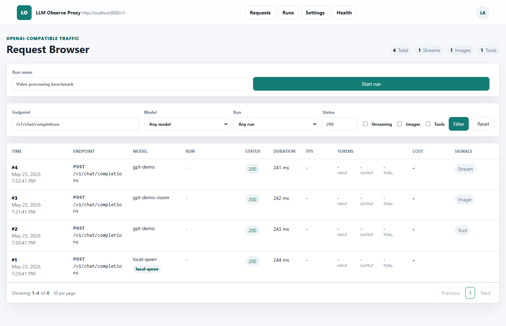
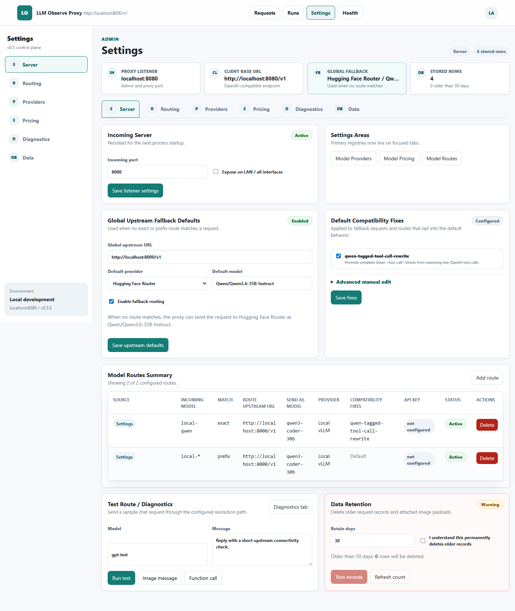
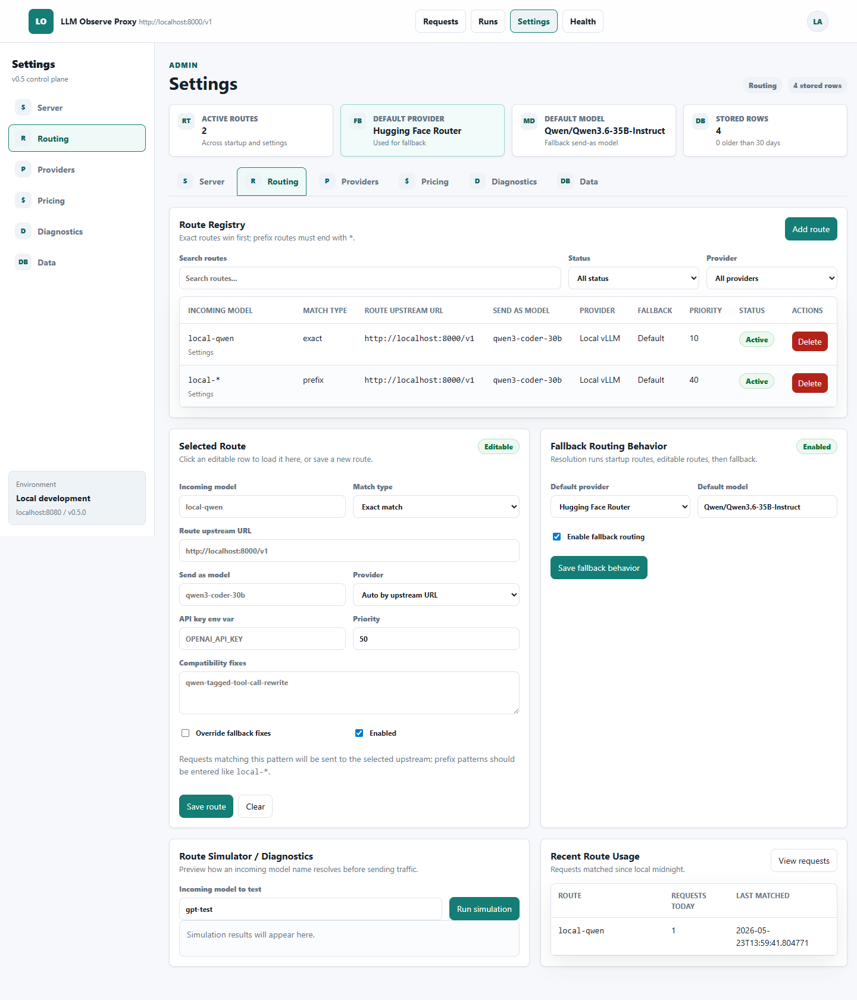
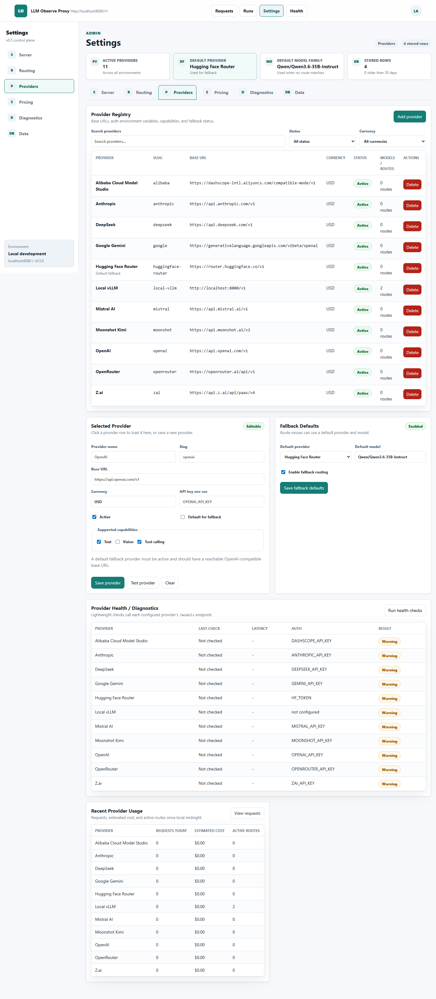
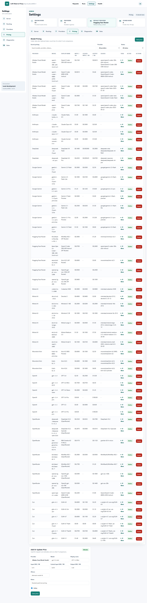
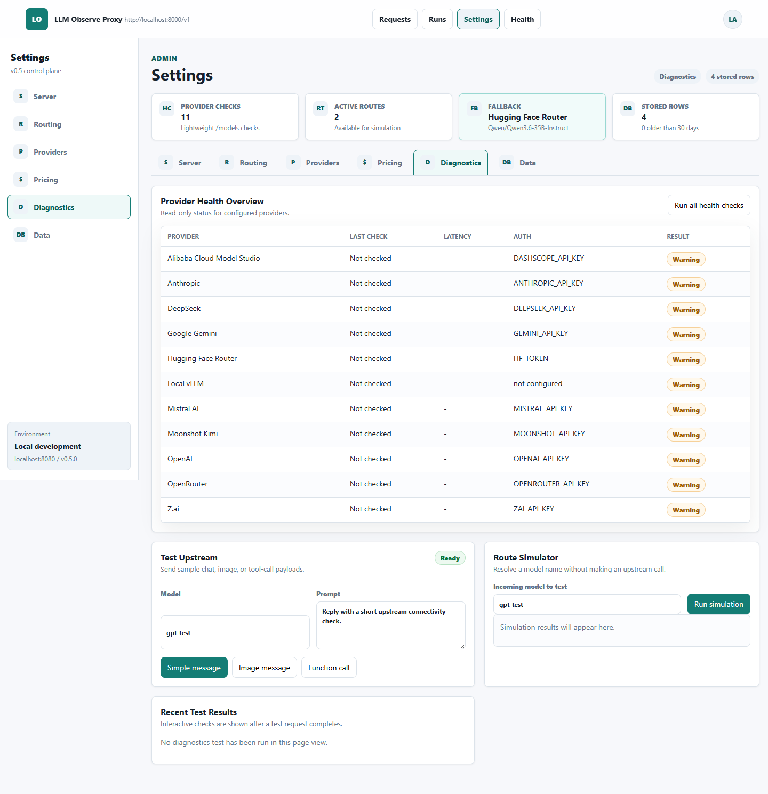
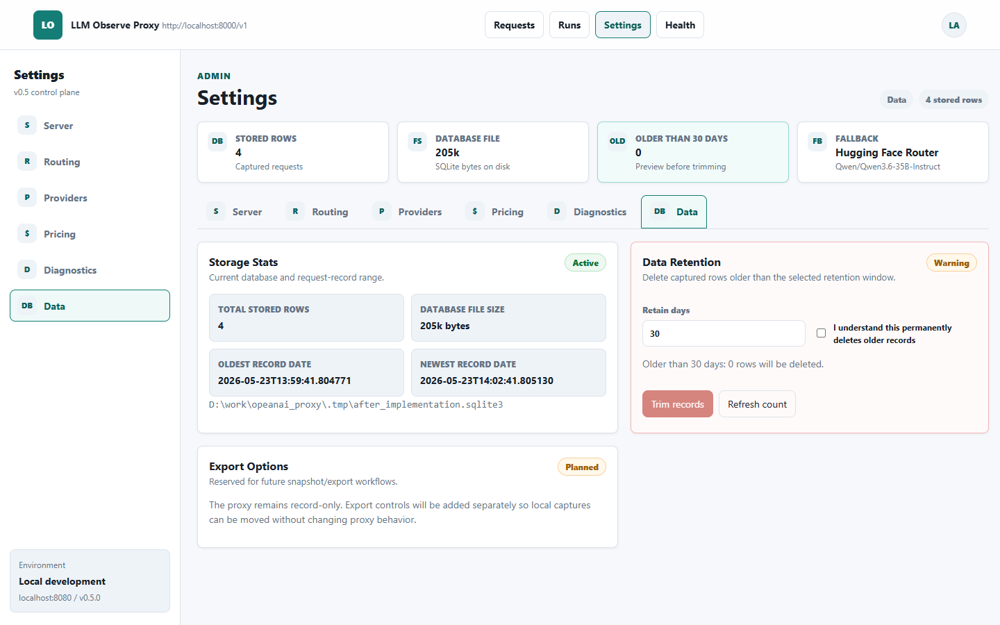

# LLM Observe Proxy Admin UI After Implementation

## Summary

This document captures the v0.5 admin UI state after implementing the Settings redesign. It compares the live tabbed Settings UI against:

- `docs/plans/v0.5/llm_observe_proxy_admin_ui_requirements_doc.md`
- `docs/plans/v0.5/mockups/server_tab.png`
- `docs/plans/v0.5/mockups/providers_tab.png`
- `docs/plans/v0.5/mockups/routing_tab.png`

Capture metadata:

- Captured on: 2026-05-23
- Server URL inspected: `http://localhost:8080`
- Health check: screenshot harness waited for `http://localhost:8080/healthz` to return `200`
- Data source: seeded demo database from `scripts/seed_demo_db.py`
- Scope: admin shell and all six Settings tabs

## Evidence

Admin request browser shell context:

Server tab:

Routing tab:

Providers tab:

Pricing tab:

Diagnostics tab:

Data tab:

## Achieved Target State

The Settings UI is now a tabbed console instead of one long mixed page. `/admin/settings` redirects to `/admin/settings/server`, and the Settings area has a left sidebar, environment/version card, top tab bar, connection summary cards, active states, and responsive layouts.

Implemented tabs:

- Server: listener settings, upstream fallback defaults, default compatibility fixes, route summary, upstream test controls, and retention danger zone.
- Routing: route registry, exact/prefix match type, priority, enabled state, fallback override, selected route editor, fallback behavior controls, simulator, and route usage.
- Providers: provider registry, active/default flags, API key env var, capabilities, selected provider editor, fallback defaults, health table, and usage table.
- Pricing: dedicated pricing registry with searchable/filterable table, collapsible tier drawers, price form, tier add/delete controls, and active-state display.
- Diagnostics: provider health overview, upstream test, route simulator, and recent test result area.
- Data: storage stats, database file size/date range, retention danger zone, and export placeholder.

The backend now supports the UI with SQLite provider/route/fallback fields, deterministic exact/prefix routing, route simulation, `/admin/api/settings/*`, `/admin/api/providers/*`, and `/admin/api/routes/*` endpoints. Legacy HTML POST endpoints remain available and redirect to the relevant tab.

## Gap Matrix

| Target area | After implementation state | Remaining notes |
|---|---|---|
| App shell/sidebar/tabs | Implemented top nav active state, Settings sidebar, tab bar, and environment card. | Sidebar is responsive by stacking on narrow viewports rather than using a hamburger toggle. |
| Connection summary | Implemented per-tab summary cards for listener, fallback, providers/routes, pricing rows, storage, and retention. | Summary cards are server-rendered; no live polling refresh. |
| Server tab | Implemented listener form, fallback provider/model, default fixes checkbox flow with advanced edit, route summary, test, and retention. | Route summary remains a compact table, not a fully interactive editor; full editing lives in Routing. |
| Providers tab | Implemented registry, filters, editor, fallback defaults, health table, and usage table. | Health checks are manual; screenshots show the seeded pre-check state. |
| Routing tab | Implemented exact/prefix routes, priority, active state, fallback override, selected editor, simulator, and usage. | Row selection is client-side for the current page; large-data server pagination is not yet exposed in HTML. |
| Pricing tab | Moved pricing into a dedicated tab with filters and collapsible tier drawers. | Large seeded pricing catalog creates a long page; future server pagination would improve scanning. |
| Diagnostics/Data separation | Implemented separate Diagnostics and Data tabs. | Data export remains a planned placeholder. |
| Safety/confirmations | Destructive route/provider/price/tier deletes use styled confirmation modals; trim requires an explicit checkbox and disabled button. | Provider delete impact text is descriptive but does not yet calculate affected rows in the modal. |
| Accessibility/responsive | Inputs have visible labels, tables use scoped headers, status badges include text, focus states are visible, and layouts stack on smaller screens. | Modal focus trapping is basic; a fuller focus loop would be a future accessibility improvement. |

## Comparison To Mockups

Server, Providers, and Routing now match the mockup intent: operational shell, sidebar, summary strip, tab row, dense registry tables, selected editors, fallback panels, diagnostics areas, and restrained visual styling.

The implementation intentionally keeps the app server-rendered and dependency-light. Instead of adding a heavy SPA layer, it uses Jinja templates, small fetch-backed actions, and existing HTML POST compatibility. Pricing, Diagnostics, and Data extend the same visual system even though the provided mockups focused on the first three tabs.

## Known Risks

- Package metadata still reports `0.4.0`; the UI labels this work as the v0.5 control plane because the release version was not bumped in this implementation.
- Provider health checks can call real provider `/models` endpoints when run by a user; screenshots avoid that by showing seeded pre-check state.
- The admin UI remains no-auth by design, so all Settings controls should stay local or on trusted networks.
- Some large tables rely on horizontal scroll and client-side filters; this is acceptable for the seeded/admin scale but may need server-side pagination for very large catalogs.

## Verification

- `.\.venv\Scripts\ruff.exe check src tests scripts`
- `.\.venv\Scripts\python.exe -m compileall -q src tests scripts`
- `.\.venv\Scripts\pytest.exe tests\test_admin_ui.py -q`
- `.\.venv\Scripts\pytest.exe -q`
- Screenshot capture with seeded demo DB on port `8080`
