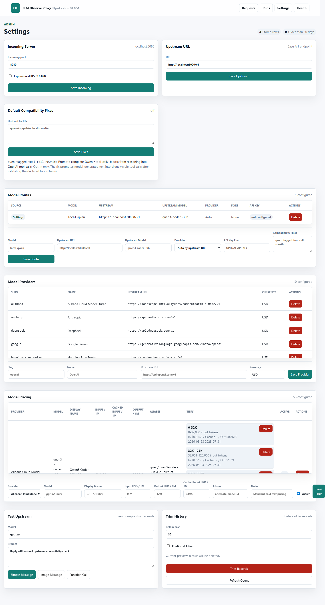
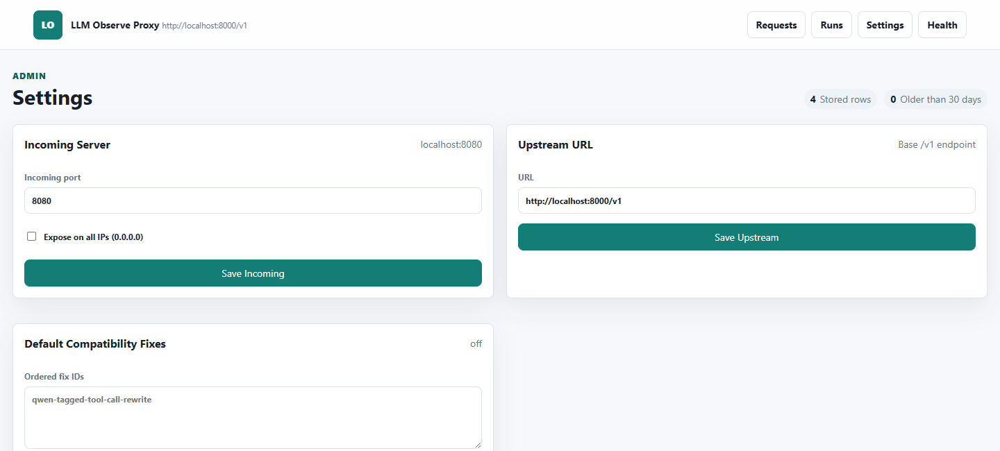
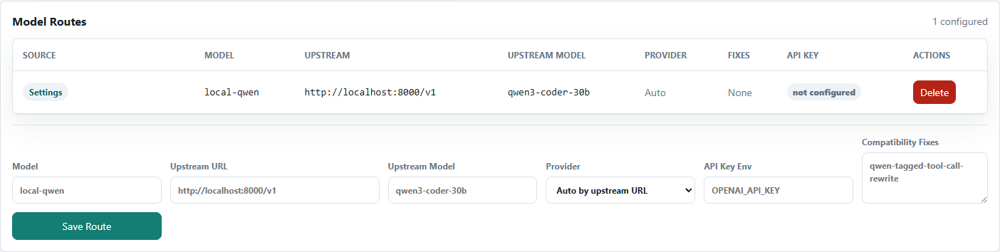
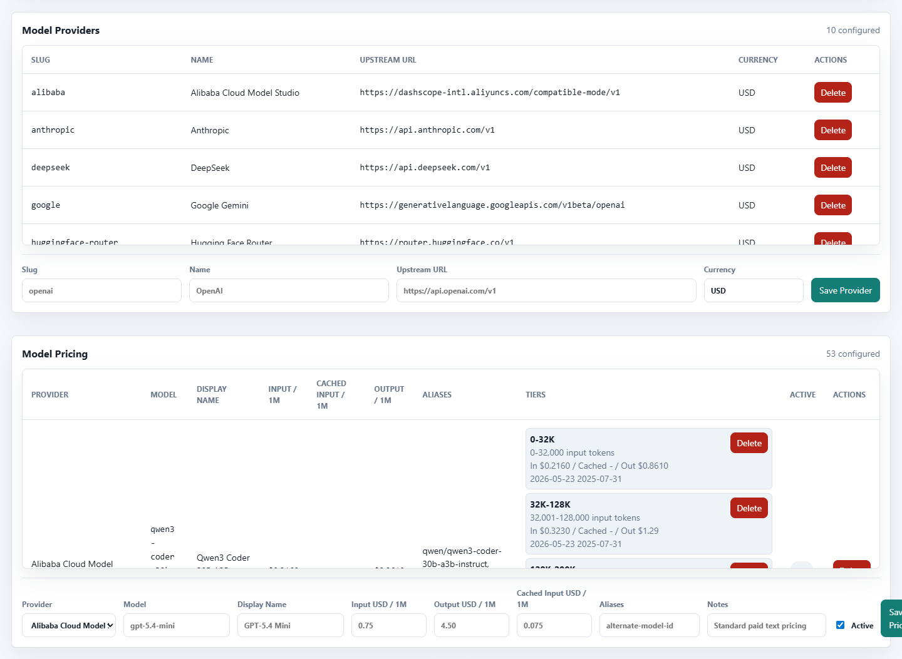
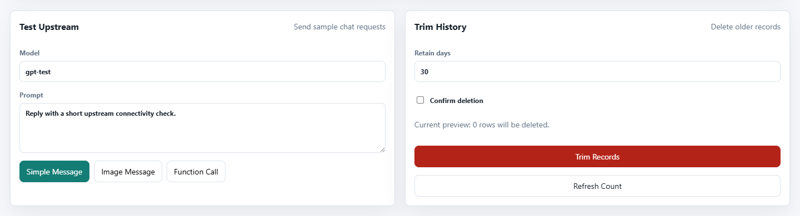
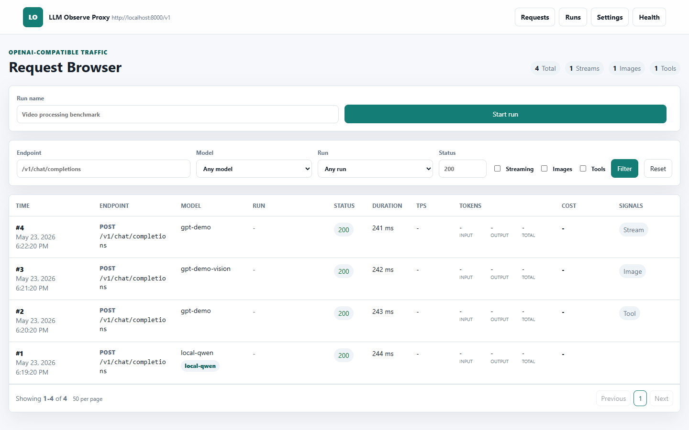

# LLM Observe Proxy Admin UI Current State

## Summary

This document captures the current admin UI state before the v0.5 Settings redesign. It compares the live `/admin/settings` page against:

- `docs/plans/v0.5/llm_observe_proxy_admin_ui_requirements_doc.md`
- `docs/plans/v0.5/mockups/server_tab.png`
- `docs/plans/v0.5/mockups/providers_tab.png`
- `docs/plans/v0.5/mockups/routing_tab.png`

Capture metadata:

- Captured on: 2026-05-23
- Server URL inspected: `http://localhost:8080/admin/settings`
- Health check: `http://localhost:8080/healthz` returned `200`
- Data source: seeded demo database from `scripts/seed_demo_db.py`
- Scope: current admin shell and Settings UI only

## Evidence

Full current Settings page:

Top of Settings page, including global nav, page stats, Incoming Server, Upstream URL, and Default Compatibility Fixes:

Current Model Routes table and inline route form:

Current Model Providers and Model Pricing sections:

Current Test Upstream and Trim History sections:

Current request browser shell context:

## Current UI Summary

The current admin UI uses a compact top navigation bar with `Requests`, `Runs`, `Settings`, and `Health`. The Settings page is a single long two-column grid rather than a tabbed settings console.

The current Settings page includes these panels on one page:

- Incoming Server
- Upstream URL
- Default Compatibility Fixes
- Model Routes
- Model Providers
- Model Pricing
- Test Upstream
- Trim History

The UI is functional and direct. It exposes important backend controls with minimal ceremony, but it mixes unrelated operational tasks together. Users must scroll through listener settings, fallback upstream configuration, compatibility fix IDs, route editing, provider editing, pricing and tier editing, upstream tests, and data deletion in one screen.

## Gap Matrix

| Target area | Current state | Gap against v0.5 target |
|---|---|---|
| App shell | Topbar exists with product mark/name and main nav. No left settings sidebar, no user/avatar affordance, and no active tab indicator matching the mockups. | Add the full admin shell from the mockups: top nav with stronger active state, settings sidebar, environment card, and version display. |
| Settings tabs | All settings are rendered on one long `/admin/settings` page. | Split into `Server`, `Routing`, `Providers`, `Pricing`, `Diagnostics`, and `Data` tabs with a shared layout. |
| Connection Summary | Page heading shows two stat pills: stored rows and older-than count. | Add the target summary strip with listener, client base URL, global/default provider/model, active routes/providers, and stored rows depending on tab. |
| Server settings | Incoming port and expose-all-IPs checkbox exist. Upstream URL exists as a standalone URL field. | Add clearer LAN exposure helper/warning text. Expand upstream defaults to store and display global upstream URL, default provider, and default model. |
| Compatibility fixes | Current UI uses a raw ordered textarea plus a help list of known fix IDs. | Replace default interaction with checkbox/chip style known fixes and keep manual editing as an advanced collapsed control. |
| Routing | Model Routes section has a table and inline create/update form. Current UI shows model, upstream URL, upstream model, provider, fixes, API key state, and delete action. | Missing dedicated Routing tab, search/filter, match type, prefix matching UI, priority, enabled state, override fallback, deterministic resolution explanation, simulator, test route action, recent route usage, and selected route editor. |
| Providers | Model Providers table supports slug, name, upstream URL, currency, delete, and inline save form. | Missing dedicated Providers tab, search/filter/pagination controls, selected provider editor, active status, fallback default toggle, API key env var, capabilities, health checks, usage summary, and provider test action. |
| Pricing | Pricing exists on the Settings page with model rows, inline tier controls, and an inline create/update form. | Move pricing to its own tab. Current tier management is dense, and the inline pricing form can overflow horizontally with the save button clipped at the right edge. |
| Diagnostics | Test Upstream supports model, prompt, and simple/image/function-call submissions. | Missing route/provider preview before running, route simulator, provider diagnostics panel, health check result table, and clearer result states. |
| Data retention | Trim History has retain-days input, confirmation checkbox, preview count, red trim button, and refresh count. | Move to a Data/Danger Zone area. Button is visually enabled before confirmation, relying on form validation. Target calls for stronger danger-zone styling and disabled state until confirmation. |
| Destructive actions | Delete buttons are inline for routes, providers, prices, and tiers. Trim requires confirmation checkbox. | Add explicit confirmation flows that name affected entities and show impact, especially for provider/route/price/tier deletes. |
| API key safety | Routes show API key env var and state, not raw key values. | Preserve this behavior, then extend provider records to store/display API key env var names without exposing values. |
| Responsiveness | Existing CSS stacks grids on smaller screens and uses table overflow containers. | Rework tabbed layouts and table/form densities so compact screens do not produce clipped controls or overly dense inline forms. |
| Accessibility | Inputs and buttons generally have visible text labels. Tables use headers. | Add clearer active states, status text paired with colors, keyboard-friendly confirmation dialogs, and focus-safe modal/drawer behavior if introduced. |

## Implementation Implications

The current backend already supports several pieces that can be reused for the first redesign pass: persisted incoming server settings, global upstream URL, UI-managed model routes, model providers, model pricing, compatibility fixes, upstream tests, and retention trimming.

The largest product gaps are information architecture and data model shape. The target UI needs structured fallback settings, richer provider metadata, route match metadata, diagnostics state, and usage summaries. Those should be added incrementally while preserving existing POST endpoints where practical.

The first UI refactor should prioritize the shared shell, tab navigation, and Connection Summary before deep feature work. After that, move current panels into their target tabs and replace the dense inline route/provider/pricing editing patterns with registry plus selected-editor workflows.
