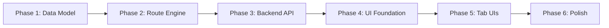

# v0.5 Admin UI Redesign — Master Implementation Plan

## Overview

This plan breaks the v0.5 admin UI redesign into **6 sequential phases**, each independently
verifiable. Phases are ordered so that each one builds on the previous: data model first,
then engine, then API, then UI foundation, then tab content, then polish.

## Phase Summary

| Phase | Name | Focus | Key Deliverables |
|:---:|---|---|---|
| 1 | [Data Model & Migrations](phase-1-data-model/plan.md) | DB schema | `ModelRoute` table, `ModelProvider` expansion, global fallback settings, migration logic |
| 2 | [Route Resolution Engine](phase-2-route-engine/plan.md) | Core logic | Prefix matching, priority ordering, fallback chain, route simulator function |
| 3 | [Backend API](phase-3-backend-api/plan.md) | REST endpoints | Provider/route CRUD APIs, health checks, usage aggregation, simulator endpoint |
| 4 | [UI Foundation](phase-4-ui-foundation/plan.md) | App shell & CSS | Sidebar, tabs, connection summary, design system, status badges |
| 5 | [Tab Implementations](phase-5-tab-implementations/plan.md) | Core UI tabs | Server, Providers, and Routing tab templates and wiring |
| 6 | [Polish & Remaining](phase-6-polish/plan.md) | Fit & finish | Pricing tab, confirmation modals, accessibility, responsive, documentation |

## Dependency Graph



## Phase Details

### Phase 1 — Data Model & Migrations

**Goal**: Establish the database schema that all subsequent phases depend on.

- Expand `ModelProvider` with `active`, `api_key_env`, `is_default_fallback`, `capabilities_json`
- Create a proper `ModelRouteDB` table replacing JSON blob storage
- Add global fallback settings (`default_provider_slug`, `default_model`)
- Write migration logic for existing data
- Full test coverage for models and CRUD helpers

**Inputs**: Current `database.py`, `config.py`
**Outputs**: Updated schema, migration functions, CRUD helpers, tests
**Plan**: [phase-1-data-model/plan.md](phase-1-data-model/plan.md)
**TODO**: [phase-1-data-model/todo.md](phase-1-data-model/todo.md)

---

### Phase 2 — Route Resolution Engine

**Goal**: Replace the exact-match-only router with a full resolution engine.

- Support `exact` and `prefix` match types
- Priority-based route ordering with deterministic tie-breaking
- Fallback chain: matched route → default provider/model → error
- Route simulator function (dry-run resolution without HTTP call)
- Full test coverage for all match/priority/fallback scenarios

**Inputs**: Phase 1 models, current `routing.py`
**Outputs**: Rewritten `routing.py`, simulator function, tests
**Plan**: [phase-2-route-engine/plan.md](phase-2-route-engine/plan.md)
**TODO**: [phase-2-route-engine/todo.md](phase-2-route-engine/todo.md)

---

### Phase 3 — Backend API

**Goal**: Expose structured JSON API endpoints for all CRUD + diagnostics.

- Provider CRUD + test + health check endpoints
- Route CRUD + test + simulate endpoints
- Settings summary + update endpoints
- Usage aggregation queries and endpoints
- Full test coverage for API contracts

**Inputs**: Phase 1 models, Phase 2 engine
**Outputs**: New API routes in `admin.py`, tests
**Plan**: [phase-3-backend-api/plan.md](phase-3-backend-api/plan.md)
**TODO**: [phase-3-backend-api/todo.md](phase-3-backend-api/todo.md)

---

### Phase 4 — UI Foundation

**Goal**: Build the app shell, design system, and shared components.

- New `base.html` with top header and main nav
- New `settings_base.html` with sidebar + tab system
- Connection Summary component
- Status badge system
- Teal/green CSS design system with cards, shadows, spacing
- Responsive sidebar behavior
- No functional tab content yet — skeleton only

**Inputs**: Mockup images, current `styles.css` and `base.html`
**Outputs**: Redesigned templates, new CSS, shared Jinja macros
**Plan**: [phase-4-ui-foundation/plan.md](phase-4-ui-foundation/plan.md)
**TODO**: [phase-4-ui-foundation/todo.md](phase-4-ui-foundation/todo.md)

---

### Phase 5 — Tab Implementations

**Goal**: Implement the three primary tabs: Server, Providers, Routing.

- Server tab: listener, upstream fallback, compat fixes, route summary, test, danger zone
- Providers tab: registry, selected editor, fallback defaults, health, usage
- Routing tab: registry, selected editor, fallback behavior, simulator, usage
- Interactive client-side behavior (search, filter, selection, pagination)
- Admin UI tests for all three tabs

**Inputs**: Phase 3 API, Phase 4 shell
**Outputs**: Tab templates, JavaScript, admin UI tests
**Plan**: [phase-5-tab-implementations/plan.md](phase-5-tab-implementations/plan.md)
**TODO**: [phase-5-tab-implementations/todo.md](phase-5-tab-implementations/todo.md)

---

### Phase 6 — Polish & Remaining

**Goal**: Complete remaining tabs and polish for release quality.

- Extract Pricing into its own tab
- Diagnostics tab (consolidated test + health view)
- Data tab (retention, trim, storage stats)
- Confirmation modals for all destructive actions
- Accessibility audit and fixes
- Responsive behavior testing
- README and documentation updates

**Inputs**: Phase 5 tabs
**Outputs**: Complete tab set, modals, accessibility, docs
**Plan**: [phase-6-polish/plan.md](phase-6-polish/plan.md)
**TODO**: [phase-6-polish/todo.md](phase-6-polish/todo.md)

---

## Quality Gates

Each phase must pass before proceeding to the next:

1. `ruff check src tests` — no lint errors
2. `python -m compileall -q src tests` — no syntax errors
3. `pytest -q` — all tests pass, including new phase tests
4. Git commit on feature branch with descriptive message

## Git Strategy

```
main
 └── feature/v0.5-admin-ui
      ├── phase-1 commits (data model)
      ├── phase-2 commits (route engine)
      ├── phase-3 commits (backend API)
      ├── phase-4 commits (UI foundation)
      ├── phase-5 commits (tab UIs)
      └── phase-6 commits (polish)
```

Merge to main after Phase 6 passes all quality gates.
