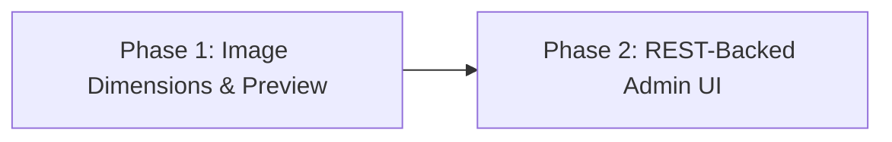

# v0.6 Admin UI Improvements — Master Implementation Plan

## Overview

This plan tracks two related v0.6 admin UI improvements. Phase 1 improves request-image
inspection. Phase 2 converts the remaining Settings data and actions to REST-backed,
in-place updates so routine admin work does not reload the whole document.

Normal navigation between Requests, Runs, request/run details, and Settings tabs remains
page-based. Once a page is open, its filters, pagination, saves, deletes, diagnostics,
and refreshes update through JSON APIs.

## Phase Summary

| Phase | Name | Focus | Key Deliverables |
|:---:|---|---|---|
| 1 | [Image Dimensions & Preview](phase-1-image-preview/plan.md) | Request detail image UX | Thumbnail dimensions, preview modal, actual-size mode, polling-safe state, tests, docs, screenshot |
| 2 | [REST-Backed Admin UI](phase-2-rest-admin-ui/plan.md) | Settings live UI | REST page payloads, pricing and diagnostics APIs, in-place rendering and mutations, state preservation, tests, docs |

## Dependency Graph



## Phase Details

### Phase 1 — Image Dimensions & Preview

**Goal**: Make captured request images easier to inspect without leaving the request
detail page.

- Show each image's intrinsic pixel dimensions alongside its MIME type.
- Open thumbnails in a fit-to-window modal.
- Provide an actual-size mode that renders the image at its intrinsic dimensions in a
  scrollable viewport.
- Keep the gallery and an open modal stable while the request detail page polls every
  second.
- Support keyboard operation, focus management, responsive layouts, and graceful image
  load failures.
- Update user documentation, test documentation, design guidance, and the seeded image
  screenshot.

**Inputs**: Existing REST-backed request detail page, image gallery, modal styling, and
seeded screenshot harness.

**Outputs**: Improved request image gallery, preview modal, focused tests, aligned docs,
and refreshed screenshot.

**Plan**: [phase-1-image-preview/plan.md](phase-1-image-preview/plan.md)

**TODO**: [phase-1-image-preview/todo.md](phase-1-image-preview/todo.md)

---

### Phase 2 — REST-Backed Admin UI

**Goal**: Eliminate full-document reloads for Settings data updates and actions while
preserving normal page navigation and the existing dependency-free frontend.

- Convert all six Settings tabs to lightweight shells populated from tab-specific JSON
  page payloads.
- Add missing REST operations for model pricing, pricing tiers, and upstream diagnostics.
- Submit saves, deletes, tests, catalog actions, and retention trimming through REST.
- Re-render only affected regions while preserving dirty forms, focus, scroll, selected
  rows, open drawers, and modals.
- Refresh on page load, successful mutations, manual refresh, history navigation, and
  safe visibility return; do not continuously poll editable Settings registries.
- Keep existing HTML POST handlers as compatibility fallbacks.
- Audit Requests and Runs so all in-page updates remain REST-backed, including Phase 1
  image modal stability during request-detail polling.

**Inputs**: Existing admin REST APIs, Settings templates, request/run live controllers,
and Phase 1 polling-safe image gallery.

**Outputs**: REST-backed Settings pages, complete admin mutation APIs, accessible
loading/error feedback, focused API/UI tests, and updated documentation.

**Plan**: [phase-2-rest-admin-ui/plan.md](phase-2-rest-admin-ui/plan.md)

**TODO**: [phase-2-rest-admin-ui/todo.md](phase-2-rest-admin-ui/todo.md)

## Quality Gates

Each phase is complete only when its focused tests and all of the following pass:

1. `.venv/bin/ruff check src tests scripts`
2. `.venv/bin/python -m compileall -q src tests scripts`
3. `.venv/bin/pytest -q`
4. `git diff --check`
5. Seeded desktop and mobile browser verification for the phase's UI behavior

## Git Strategy

```text
feature/admin-fallback-clarity
 └── feature/image-dimensions-preview
      ├── docs: add v0.6 image preview plan
      ├── docs: add v0.6 REST admin UI phase
      ├── feat: add request image dimensions and preview modal
      ├── test: cover request image preview behavior
      ├── feat: add REST-backed settings pages
      ├── test: cover REST-backed admin UI
      └── docs: document v0.6 admin UI improvements
```

Keep commits focused and do not mix unrelated settings, routing, pricing, capture, or
token-accounting changes into this feature branch.

## Release Constraints

- Preserve record-only proxy behavior.
- Do not add a database migration or persist image dimensions.
- Do not change public `/api/*` contracts or the admin request-detail JSON shape.
- New JSON routes must remain under `/admin/api/*`.
- Do not add a runtime or frontend dependency.
- Keep data URL and remote URL image support.
- Keep one-second polling for Requests and Runs; Settings uses event-driven refresh.
- Keep HTML POST handlers available as compatibility fallbacks.
