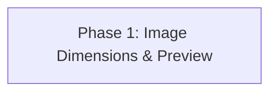

# v0.6 Image Preview — Master Implementation Plan

## Overview

This plan tracks the v0.6 request-image gallery improvements. The first phase adds
intrinsic image dimensions to request thumbnails and an accessible preview modal with
fit-to-window and actual-size viewing modes.

The structure is intentionally expandable so later v0.6 work can be added as separate
phases without broadening Phase 1.

## Phase Summary

| Phase | Name | Focus | Key Deliverables |
|:---:|---|---|---|
| 1 | [Image Dimensions & Preview](phase-1-image-preview/plan.md) | Request detail image UX | Thumbnail dimensions, preview modal, actual-size mode, polling-safe state, tests, docs, screenshot |

## Dependency Graph



## Phase Details

### Phase 1 — Image Dimensions & Preview

**Goal**: Make captured request images easier to inspect without leaving the request
detail page.

- Show each image's intrinsic pixel dimensions alongside its MIME type.
- Open thumbnails in a fit-to-window modal.
- Provide an actual-size mode that renders the image at its intrinsic dimensions in a
  scrollable viewport.
- Keep the gallery and an open modal stable while the request detail page polls every
  second.
- Support keyboard operation, focus management, responsive layouts, and graceful image
  load failures.
- Update user documentation, test documentation, design guidance, and the seeded image
  screenshot.

**Inputs**: Existing REST-backed request detail page, image gallery, modal styling, and
seeded screenshot harness.

**Outputs**: Improved request image gallery, preview modal, focused tests, aligned docs,
and refreshed screenshot.

**Plan**: [phase-1-image-preview/plan.md](phase-1-image-preview/plan.md)

**TODO**: [phase-1-image-preview/todo.md](phase-1-image-preview/todo.md)

## Quality Gates

Phase 1 is complete only when all of the following pass:

1. `.venv/bin/ruff check src tests scripts`
2. `.venv/bin/python -m compileall -q src tests scripts`
3. `.venv/bin/pytest -q`
4. `git diff --check`
5. Seeded browser verification of the image gallery and modal at desktop and mobile
   widths

## Git Strategy

```text
feature/admin-fallback-clarity
 └── feature/image-dimensions-preview
      ├── docs: add v0.6 image preview plan
      ├── feat: add request image dimensions and preview modal
      ├── test: cover request image preview behavior
      └── docs: document request image previews
```

Keep commits focused and do not mix unrelated settings, routing, pricing, capture, or
token-accounting changes into this feature branch.

## Release Constraints

- Preserve record-only proxy behavior.
- Do not add a database migration or persist image dimensions.
- Do not change the public API or the admin request-detail JSON shape.
- Do not add a runtime or frontend dependency.
- Keep data URL and remote URL image support.
